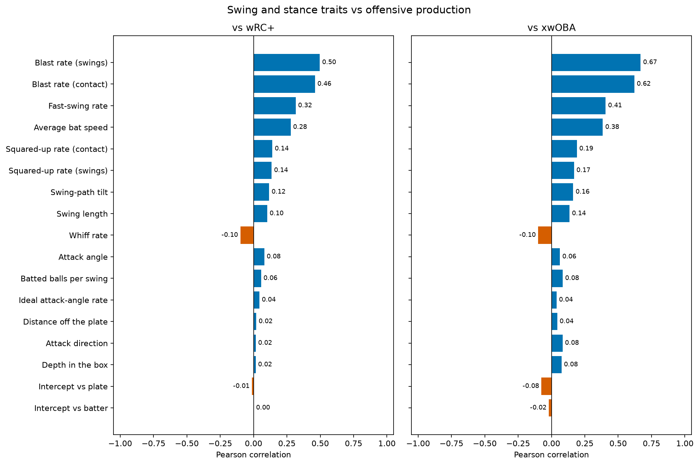
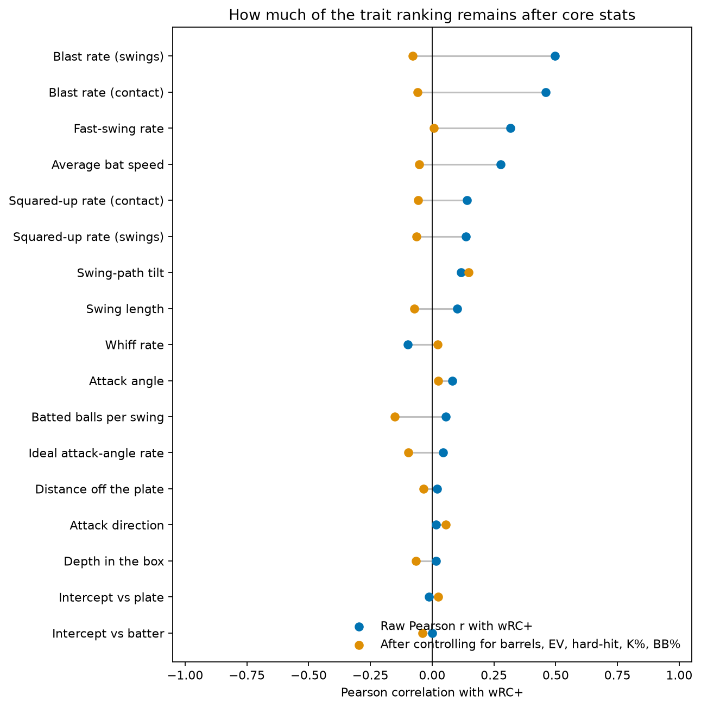

# MLB Offensive Production Data Analysis

This project builds a player-season dataset and grouped regression analysis for studying how swing behavior and hitter traits relate to offensive production. It uses 2024, 2025, and 2026 YTD by default because 2024 is the first full
season of public Statcast bat tracking.

My goal with this project was to see how much swing and stance metrics made newly available a couple years ago affect offensive production, and to see whether those same traits could reconstruct same-season wRC+ with any kind of accuracy.

What I learned was that blast and bat speed ranked the highest, with ranking collapsing soon after. 





OPS and wOBA are production, we would just end up ranking the outcome against itself if it was included in the ranking. Barrels and exit velocity come after the swing, where we've already reached a high value outcome. The question being posed concerns the swing itself, and what traits of the swing produce high value outcomes.

## Conclusion

Ultimately this project revealed that there are a lot of different ways to be successful as a hitter in the league, and even the stats we consider to be good indicators of offensive success still have relatively low correlation. It's almost a foregone conclusion that "if you square up the ball and hit it hard, you'll have a good time". The physical traits proved to be less valuable than I initally expected, but it also speaks to the variation that exists from player to player that make the game interesting. If everyone hit the same way, it wouldn't make for a very exciting game.

I think there is still more space for analysis, especially considering we are limited by what Statcast measures. Perhaps in a later study, more biomechanical data can be studied to give a clearer image as to what mechanics correlate towards better success in the league. 

## How it was built

Player-seasons are joined from Baseball Savant (bat tracking, stance, and expected stats), FanGraphs (wRC+ and plate discipline), and Baseball-Reference (combined OPS+, including traded players). The analysis uses 2024–2026 with `PA >= 100` and at least 50 competitive swings. Reconstruction is nested cross-validation grouped by player, so a hitter’s seasons never leak across train and test. OPS, wOBA, and xwOBA are never used as predictors of wRC+.

- **Baseball Savant:** wOBA, xwOBA, xBA, xSLG, bat speed, swing length,
squared-up/blast/whiff rates, attack angle, swing-path tilt, stance position,
and intercept position.
- **FanGraphs:** OPS, wRC+, plate-discipline rates, and contact-quality context.
- **Baseball-Reference:** exact combined player-season OPS+, including a single
combined row for traded players.

Savant's CSV exports and FanGraphs' JSON endpoint are public but the responses are messy. Raw responses are cached. FanGraphs says automated access is unsupported, and Baseball-Reference rate limits automated requests; do not delete caches merely to rerun an analysis.

## Caveats

- This is same-season association, not a causal claim and not a next-year forecast.
- 2026 is year-to-date and is frozen at `retrieved_on`.
- A negative bat-speed OLS coefficient after barrels and exit velocity are in the model is collinearity, not evidence that swinging faster hurts production.
- `distance_off_plate` and `depth_in_box` are Statcast stance-position fields, measured from the hitter's center of mass. They are not pitch-location data.
- wRC+ and OPS+ come from different providers and should remain source-labeled.


## Reproduce

```powershell
uv pip install --python .venv\Scripts\python.exe -e ".[dev]"
collect-mlb-offense
.venv\Scripts\jupyter.exe nbconvert --to notebook --execute offensive_analysis.ipynb --output offensive_analysis.executed.ipynb
.venv\Scripts\python.exe -m pytest
```

